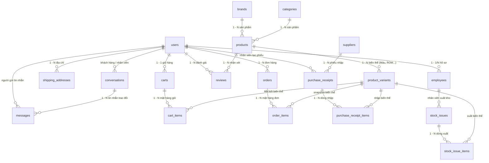

# Tài liệu Cấu trúc Cơ sở dữ liệu (Database Documentation)

Tài liệu này tổng hợp chi tiết cấu trúc cơ sở dữ liệu MySQL (`web-phone.sql` / Database: `web-phone`) cho hệ thống website thương mại điện tử kinh doanh điện thoại di động & thiết bị công nghệ.

---

## 1. Tổng quan Cấu trúc Hệ thống

Hệ thống bao gồm đầy đủ **27 bảng** được phân chia thành các phân hệ nghiệp vụ chính:

1. **Phân hệ Người dùng & Nhân sự (3 bảng)**: `users`, `employees`, `shipping_addresses`
2. **Phân hệ Sản phẩm & Thương hiệu (4 bảng)**: `categories`, `brands`, `products`, `product_variants`
3. **Phân hệ Giỏ hàng & Đơn hàng (4 bảng)**: `carts`, `cart_items`, `orders`, `order_items`
4. **Phân hệ Quản lý Kho & Nhập/Xuất hàng (5 bảng)**: `suppliers`, `purchase_receipts`, `purchase_receipt_items`, `stock_issues`, `stock_issue_items`
5. **Phân hệ Hỗ trợ & Trò chuyện trực tuyến (2 bảng)**: `conversations`, `messages`
6. **Phân hệ Đánh giá & Quảng cáo (2 bảng)**: `reviews`, `banners`
7. **Phân hệ Hệ thống & Quản lý Queue/Cache Laravel (7 bảng)**: `migrations`, `password_reset_tokens`, `jobs`, `job_batches`, `failed_jobs`, `cache`, `cache_locks`

---

## 2. Chi tiết các Bảng Dữ liệu (Việt hóa & Mô tả chi tiết)

### 2.1. Phân hệ Người dùng & Nhân sự

#### Bảng `users` (Tài khoản người dùng)
Lưu trữ thông tin tài khoản đăng nhập của tất cả đối tượng (khách hàng, nhân viên, quản trị viên).
| Tên trường | Kiểu dữ liệu | Thuộc tính | Mô tả chi tiết |
| :--- | :--- | :--- | :--- |
| `id` | BIGINT(20) UNSIGNED | PRIMARY KEY, AUTO_INCREMENT | Mã định danh người dùng duy nhất |
| `full_name` | VARCHAR(255) | NOT NULL | Họ và tên đầy đủ |
| `email` | VARCHAR(255) | NOT NULL, UNIQUE | Địa chỉ Email (dùng đăng nhập) |
| `email_verified_at` | TIMESTAMP | NULL | Thời điểm xác thực email |
| `password` | VARCHAR(255) | NOT NULL | Mật khẩu đã được mã hóa (Bcrypt) |
| `role` | ENUM | NOT NULL, DEFAULT 'Khách hàng' | Vai trò: `'Khách hàng'`, `'Nhân viên sale'`, `'Nhân viên kho'`, `'Quản trị viên'` |
| `status` | ENUM | NOT NULL, DEFAULT 'Active' | Trạng thái tài khoản: `'Active'` (Hoạt động), `'Locked'` (Bị khóa) |
| `created_at` | TIMESTAMP | NULL | Thời điểm tạo tài khoản |
| `updated_at` | TIMESTAMP | NULL | Thời điểm cập nhật thông tin gần nhất |
| `deleted_at` | TIMESTAMP | NULL | Thời điểm xóa mềm (Soft delete) |

#### Bảng `employees` (Hồ sơ nhân viên)
Lưu thông tin nghiệp vụ/hành chính bổ sung dành riêng cho nhân viên.
| Tên trường | Kiểu dữ liệu | Thuộc tính | Mô tả chi tiết |
| :--- | :--- | :--- | :--- |
| `id` | BIGINT(20) UNSIGNED | PRIMARY KEY, AUTO_INCREMENT | Mã định danh hồ sơ nhân viên |
| `user_id` | BIGINT(20) UNSIGNED | NOT NULL, FOREIGN KEY | Liên kết với tài khoản `users(id)` |
| `identity_number` | CHAR(12) | NOT NULL | Số Căn cước công dân / CMND |
| `bank_account_number` | VARCHAR(100) | NOT NULL | Số tài khoản ngân hàng nhận lương |
| `hire_date` | DATE | NOT NULL | Ngày chính thức vào làm việc |

#### Bảng `shipping_addresses` (Sổ địa chỉ giao hàng)
Địa chỉ nhận hàng mặc định/lưu sẵn của khách hàng.
| Tên trường | Kiểu dữ liệu | Thuộc tính | Mô tả chi tiết |
| :--- | :--- | :--- | :--- |
| `id` | BIGINT(20) UNSIGNED | PRIMARY KEY, AUTO_INCREMENT | Mã địa chỉ |
| `user_id` | BIGINT(20) UNSIGNED | NOT NULL, FOREIGN KEY | Khách hàng sở hữu `users(id)` |
| `phone_number` | CHAR(12) | NOT NULL | Số điện thoại liên hệ nhận hàng |
| `address` | TEXT | NOT NULL | Địa chỉ chi tiết (số nhà, đường, phường/xã, quận/huyện, tỉnh/TP) |

---

### 2.2. Phân hệ Sản phẩm & Thương hiệu

#### Bảng `categories` (Danh mục sản phẩm)
Phân loại thiết bị (Điện thoại, Tablet, Laptop, Phụ kiện...).
| Tên trường | Kiểu dữ liệu | Thuộc tính | Mô tả chi tiết |
| :--- | :--- | :--- | :--- |
| `id` | BIGINT(20) UNSIGNED | PRIMARY KEY, AUTO_INCREMENT | Mã danh mục |
| `name` | VARCHAR(255) | NOT NULL | Tên danh mục sản phẩm |
| `created_at` | TIMESTAMP | NULL | Thời điểm tạo |
| `updated_at` | TIMESTAMP | NULL | Thời điểm cập nhật |
| `deleted_at` | TIMESTAMP | NULL | Thời điểm xóa mềm |

#### Bảng `brands` (Thương hiệu / Hãng sản xuất)
Các hãng công nghệ (Apple, Samsung, Xiaomi, OPPO...).
| Tên trường | Kiểu dữ liệu | Thuộc tính | Mô tả chi tiết |
| :--- | :--- | :--- | :--- |
| `id` | BIGINT(20) UNSIGNED | PRIMARY KEY, AUTO_INCREMENT | Mã thương hiệu |
| `name` | VARCHAR(255) | NOT NULL | Tên thương hiệu |
| `created_at` | TIMESTAMP | NULL | Thời điểm tạo |
| `updated_at` | TIMESTAMP | NULL | Thời điểm cập nhật |
| `deleted_at` | TIMESTAMP | NULL | Thời điểm xóa mềm |

#### Bảng `products` (Thông tin sản phẩm chung)
Lưu thông tin tổng quan của thiết bị (tên, hãng, danh mục, thông số, ảnh...).
| Tên trường | Kiểu dữ liệu | Thuộc tính | Mô tả chi tiết |
| :--- | :--- | :--- | :--- |
| `id` | BIGINT(20) UNSIGNED | PRIMARY KEY, AUTO_INCREMENT | Mã sản phẩm |
| `brand_id` | BIGINT(20) UNSIGNED | NOT NULL, FOREIGN KEY | Khóa ngoại liên kết `brands(id)` |
| `category_id` | BIGINT(20) UNSIGNED | NOT NULL, FOREIGN KEY | Khóa ngoại liên kết `categories(id)` |
| `product_name` | VARCHAR(255) | NOT NULL | Tên gọi thương mại của sản phẩm |
| `slug` | VARCHAR(255) | NULL, UNIQUE | Đường dẫn thân thiện SEO (duy nhất) |
| `thumbnail` | VARCHAR(255) | NULL | Đường dẫn ảnh đại diện chính của sản phẩm |
| `review_video` | VARCHAR(255) | NULL | Link video YouTube/đánh giá trên tay |
| `discount_perventage` | INT(11) | NOT NULL | Phần trăm giảm giá khuyến mãi (từ gốc trong DB) |
| `images` | LONGTEXT (JSON) | NULL, CHECK(json_valid) | Bộ sưu tập ảnh chi tiết (dạng mảng JSON) |
| `specifications` | LONGTEXT (JSON) | NULL, CHECK(json_valid) | Bảng thông số kỹ thuật (Màn hình, Chip, Pin...) dạng JSON |
| `is_sale` | CHAR(1) | NOT NULL | Cờ bật hiển thị sản phẩm giảm giá ('1': có, '0': không) |
| `created_at` | TIMESTAMP | NULL | Thời điểm tạo |
| `updated_at` | TIMESTAMP | NULL | Thời điểm cập nhật |
| `deleted_at` | TIMESTAMP | NULL | Thời điểm xóa mềm |

#### Bảng `product_variants` (Biến thể sản phẩm)
Các phiên bản cụ thể theo Màu sắc, Dung lượng bộ nhớ, RAM với giá bán và tồn kho riêng.
| Tên trường | Kiểu dữ liệu | Thuộc tính | Mô tả chi tiết |
| :--- | :--- | :--- | :--- |
| `id` | BIGINT(20) UNSIGNED | PRIMARY KEY, AUTO_INCREMENT | Mã biến thể sản phẩm |
| `product_id` | BIGINT(20) UNSIGNED | NOT NULL, FOREIGN KEY | Thuộc về sản phẩm `products(id)` |
| `selling_price` | DECIMAL(15,2) | NOT NULL | Giá niêm yết bán lẻ cho khách |
| `average_cost` | DECIMAL(15,2) | NOT NULL | Giá vốn bình quân phục vụ tính lợi nhuận |
| `stock_quantity` | INT(11) | NOT NULL, DEFAULT 0 | Số lượng hàng thực tế còn trong kho |
| `attributes` | LONGTEXT (JSON) | NULL, CHECK(json_valid) | Thuộc tính phiên bản (vd: `{"color": "Titan", "storage": "256GB"}`) |
| `created_at` | TIMESTAMP | NULL | Thời điểm tạo |
| `updated_at` | TIMESTAMP | NULL | Thời điểm cập nhật |
| `deleted_at` | TIMESTAMP | NULL | Thời điểm xóa mềm |

---

### 2.3. Phân hệ Giỏ hàng & Đơn hàng

#### Bảng `carts` (Giỏ hàng người dùng)
Mỗi tài khoản người dùng gắn liền với một giỏ hàng mua sắm.
| Tên trường | Kiểu dữ liệu | Thuộc tính | Mô tả chi tiết |
| :--- | :--- | :--- | :--- |
| `id` | BIGINT(20) UNSIGNED | PRIMARY KEY, AUTO_INCREMENT | Mã giỏ hàng |
| `user_id` | BIGINT(20) UNSIGNED | NOT NULL, FOREIGN KEY | Chủ sở hữu giỏ hàng `users(id)` |
| `created_at` | TIMESTAMP | NULL | Thời điểm tạo giỏ |
| `updated_at` | TIMESTAMP | NULL | Thời điểm giỏ cập nhật |
| `deleted_at` | TIMESTAMP | NULL | Thời điểm xóa mềm |

#### Bảng `cart_items` (Mục sản phẩm trong giỏ hàng)
Lưu chi tiết từng mặt hàng và số lượng mà khách chọn mua.
| Tên trường | Kiểu dữ liệu | Thuộc tính | Mô tả chi tiết |
| :--- | :--- | :--- | :--- |
| `id` | BIGINT(20) UNSIGNED | PRIMARY KEY, AUTO_INCREMENT | Mã mục giỏ hàng |
| `cart_id` | BIGINT(20) UNSIGNED | NOT NULL, FOREIGN KEY | Khóa ngoại liên kết `carts(id)` |
| `product_variant_id` | BIGINT(20) UNSIGNED | NOT NULL, FOREIGN KEY | Biến thể cụ thể `product_variants(id)` |
| `quantity` | INT(10) UNSIGNED | NOT NULL | Số lượng sản phẩm khách chọn |

*Ràng buộc: `UNIQUE KEY(cart_id, product_variant_id)` chống trùng lặp biến thể trong cùng giỏ.*

#### Bảng `orders` (Đơn đặt hàng)
Thông tin tổng quan của một đơn hàng được tạo.
| Tên trường | Kiểu dữ liệu | Thuộc tính | Mô tả chi tiết |
| :--- | :--- | :--- | :--- |
| `id` | BIGINT(20) UNSIGNED | PRIMARY KEY, AUTO_INCREMENT | Mã số đơn hàng |
| `user_id` | BIGINT(20) UNSIGNED | NOT NULL, FOREIGN KEY | Tài khoản người đặt `users(id)` |
| `order_status` | ENUM | NOT NULL, DEFAULT 'Chờ xử lý' | Trạng thái: `'Chờ xử lý'`, `'Đã xác nhận'`, `'Đang giao'`, `'Thành công'`, `'Đã hủy'` |
| `payment_status` | ENUM | NOT NULL, DEFAULT 'Unpaid' | Trạng thái thanh toán: `'Unpaid'` (Chưa trả), `'Paid'` (Đã thanh toán) |
| `payment_method` | ENUM | NOT NULL | Phương thức: `'cod'` (Thu tiền khi nhận), `'vn_pay'` (Cổng VNPAY) |
| `recipient_name` | VARCHAR(255) | NOT NULL | Tên người nhận hàng |
| `recipient_address` | TEXT | NOT NULL | Địa chỉ giao hàng cụ thể |
| `recipient_phone` | VARCHAR(15) | NOT NULL | Số điện thoại liên lạc nhận hàng |
| `total_amount` | DECIMAL(15,2) | NOT NULL, DEFAULT 0.00 | Tổng số tiền thanh toán của đơn hàng |
| `created_at` | TIMESTAMP | NULL | Thời điểm đặt hàng |
| `updated_at` | TIMESTAMP | NULL | Thời điểm cập nhật trạng thái đơn |
| `deleted_at` | TIMESTAMP | NULL | Thời điểm xóa mềm |

#### Bảng `order_items` (Chi tiết mặt hàng trong đơn)
Lưu snapshot toàn bộ thông tin sản phẩm tại thời điểm mua (tránh bị thay đổi khi giá/tên sản phẩm sau này đổi).
| Tên trường | Kiểu dữ liệu | Thuộc tính | Mô tả chi tiết |
| :--- | :--- | :--- | :--- |
| `id` | BIGINT(20) UNSIGNED | PRIMARY KEY, AUTO_INCREMENT | Mã chi tiết đơn |
| `order_id` | BIGINT(20) UNSIGNED | NOT NULL, FOREIGN KEY | Thuộc đơn hàng `orders(id)` |
| `product_variant_id` | BIGINT(20) UNSIGNED | NOT NULL, FOREIGN KEY | Khóa ngoại liên kết `product_variants(id)` |
| `product_name` | VARCHAR(255) | NOT NULL | Tên sản phẩm tại thời điểm đặt |
| `product_thumbnail` | VARCHAR(255) | NOT NULL | Hình ảnh sản phẩm tại thời điểm đặt |
| `unit_price` | DECIMAL(15,2) | NOT NULL | Đơn giá mua thực tế 1 sản phẩm |
| `variant_attributes` | LONGTEXT (JSON) | NULL, CHECK(json_valid) | Thuộc tính phiên bản tại thời điểm mua |
| `quantity` | INT(10) UNSIGNED | NOT NULL | Số lượng mua |
| `total_amount` | DECIMAL(15,2) | NOT NULL | Thành tiền (`unit_price * quantity`) |

---

### 2.4. Phân hệ Quản lý Kho & Nhập/Xuất hàng

#### Bảng `suppliers` (Nhà cung cấp)
Đối tác phân phối hàng hóa đầu vào cho hệ thống.
| Tên trường | Kiểu dữ liệu | Thuộc tính | Mô tả chi tiết |
| :--- | :--- | :--- | :--- |
| `id` | BIGINT(20) UNSIGNED | PRIMARY KEY, AUTO_INCREMENT | Mã nhà cung cấp |
| `company_name` | VARCHAR(255) | NOT NULL | Tên công ty/nhà phân phối |
| `address` | VARCHAR(255) | NOT NULL | Địa chỉ trụ sở/văn phòng |
| `phone_number` | CHAR(12) | NOT NULL | Số điện thoại liên hệ |
| `created_at` | TIMESTAMP | NULL | Thời điểm tạo |
| `updated_at` | TIMESTAMP | NULL | Thời điểm cập nhật |
| `deleted_at` | TIMESTAMP | NULL | Thời điểm xóa mềm |

#### Bảng `purchase_receipts` (Phiếu nhập kho)
Ghi nhận một đợt nhập hàng từ nhà cung cấp.
| Tên trường | Kiểu dữ liệu | Thuộc tính | Mô tả chi tiết |
| :--- | :--- | :--- | :--- |
| `id` | BIGINT(20) UNSIGNED | PRIMARY KEY, AUTO_INCREMENT | Mã số phiếu nhập kho |
| `employee_id` | BIGINT(20) UNSIGNED | NOT NULL, FOREIGN KEY | Nhân viên lập phiếu `users(id)` |
| `supplier_id` | BIGINT(20) UNSIGNED | NULL, FOREIGN KEY | Nhà cung ứng giao hàng `suppliers(id)` |
| `received_at` | DATE | NOT NULL | Ngày thực tế nhận và kiểm hàng vào kho |
| `total_amount` | DECIMAL(15,2) | NOT NULL, DEFAULT 0.00 | Tổng tiền trị giá đợt nhập kho |
| `created_at` | TIMESTAMP | NULL | Thời điểm tạo phiếu |
| `updated_at` | TIMESTAMP | NULL | Thời điểm cập nhật |
| `deleted_at` | TIMESTAMP | NULL | Thời điểm xóa mềm |

#### Bảng `purchase_receipt_items` (Chi tiết dòng hàng nhập kho)
Danh sách các mặt hàng trong phiếu nhập.
| Tên trường | Kiểu dữ liệu | Thuộc tính | Mô tả chi tiết |
| :--- | :--- | :--- | :--- |
| `id` | BIGINT(20) UNSIGNED | PRIMARY KEY, AUTO_INCREMENT | Mã dòng nhập |
| `purchase_receipt_id` | BIGINT(20) UNSIGNED | NOT NULL, FOREIGN KEY | Thuộc phiếu nhập `purchase_receipts(id)` |
| `product_variant_id` | BIGINT(20) UNSIGNED | NOT NULL, FOREIGN KEY | Biến thể được nhập `product_variants(id)` |
| `quantity` | INT(10) UNSIGNED | NOT NULL | Số lượng nhập thêm vào kho |
| `unit_price` | DECIMAL(15,2) | NOT NULL | Đơn giá vốn nhập 1 chiếc |
| `total_amount` | DECIMAL(15,2) | NOT NULL | Thành tiền (`unit_price * quantity`) |
| `note` | TEXT | NULL | Ghi chú chất lượng hàng / số lô kiểm tra |

#### Bảng `stock_issues` (Phiếu xuất kho)
Ghi nhận xuất hàng ra khỏi kho (chuyển chi nhánh, trả bảo hành, xuất hủy, điều chuyển).
| Tên trường | Kiểu dữ liệu | Thuộc tính | Mô tả chi tiết |
| :--- | :--- | :--- | :--- |
| `id` | BIGINT(20) UNSIGNED | PRIMARY KEY, AUTO_INCREMENT | Mã số phiếu xuất kho |
| `employee_id` | BIGINT(20) UNSIGNED | NOT NULL, FOREIGN KEY | Nhân viên kho thực hiện `employees(id)` |
| `recipient_name` | VARCHAR(255) | NOT NULL | Tên người nhận hàng / đơn vị tiếp nhận |
| `recipient_address` | TEXT | NOT NULL | Địa điểm nhận hàng |
| `reason` | VARCHAR(255) | NOT NULL | Lý do xuất kho (bảo hành, điều chuyển, mẫu trưng bày...) |
| `issued_at` | DATE | NOT NULL | Ngày xuất hàng |
| `note` | TEXT | NULL | Ghi chú thêm |
| `total_amount` | DECIMAL(15,2) | NOT NULL, DEFAULT 0.00 | Tổng giá trị hàng xuất kho |
| `created_at` | TIMESTAMP | NULL | Thời điểm tạo phiếu |
| `updated_at` | TIMESTAMP | NULL | Thời điểm cập nhật |
| `deleted_at` | TIMESTAMP | NULL | Thời điểm xóa mềm |

#### Bảng `stock_issue_items` (Chi tiết dòng hàng xuất kho)
Chi tiết từng mặt hàng và số lượng xuất trong phiếu xuất.
| Tên trường | Kiểu dữ liệu | Thuộc tính | Mô tả chi tiết |
| :--- | :--- | :--- | :--- |
| `id` | BIGINT(20) UNSIGNED | PRIMARY KEY, AUTO_INCREMENT | Mã dòng xuất |
| `stock_issue_id` | BIGINT(20) UNSIGNED | NOT NULL, FOREIGN KEY | Thuộc phiếu xuất `stock_issues(id)` |
| `product_variant_id` | BIGINT(20) UNSIGNED | NOT NULL, FOREIGN KEY | Biến thể xuất kho `product_variants(id)` |
| `quantity` | INT(10) UNSIGNED | NOT NULL | Số lượng xuất giảm kho |
| `unit_price` | DECIMAL(15,2) | NOT NULL | Đơn giá tính cho mặt hàng xuất |
| `total_amount` | DECIMAL(15,2) | NOT NULL | Tổng tiền dòng xuất |
| `note` | TEXT | NULL | Ghi chú dòng hàng |

---

### 2.5. Phân hệ Hỗ trợ & Trò chuyện trực tuyến (Chat)

#### Bảng `conversations` (Phiên trò chuyện / Hỗ trợ)
Phiên tư vấn trực tiếp giữa khách hàng và nhân viên hỗ trợ.
| Tên trường | Kiểu dữ liệu | Thuộc tính | Mô tả chi tiết |
| :--- | :--- | :--- | :--- |
| `id` | BIGINT(20) UNSIGNED | PRIMARY KEY, AUTO_INCREMENT | Mã phiên hội thoại |
| `customer_id` | BIGINT(20) UNSIGNED | NOT NULL, FOREIGN KEY | Tài khoản khách hàng `users(id)` |
| `employee_id` | BIGINT(20) UNSIGNED | NULL, FOREIGN KEY | Tài khoản nhân viên tiếp nhận `users(id)` |
| `status` | ENUM | NOT NULL, DEFAULT 'Processing' | Trạng thái: `'Processing'` (Đang trò chuyện), `'Closed'` (Đã đóng) |
| `created_at` | TIMESTAMP | NULL | Thời điểm mở phòng chat |
| `updated_at` | TIMESTAMP | NULL | Thời điểm cập nhật phòng |
| `deleted_at` | TIMESTAMP | NULL | Thời điểm xóa mềm |

#### Bảng `messages` (Tin nhắn trao đổi)
Nội dung chi tiết từng câu thoại trong phiên chat.
| Tên trường | Kiểu dữ liệu | Thuộc tính | Mô tả chi tiết |
| :--- | :--- | :--- | :--- |
| `id` | BIGINT(20) UNSIGNED | PRIMARY KEY, AUTO_INCREMENT | Mã tin nhắn |
| `conversation_id` | BIGINT(20) UNSIGNED | NOT NULL, FOREIGN KEY | Thuộc phòng chat `conversations(id)` |
| `sender_id` | BIGINT(20) UNSIGNED | NOT NULL, FOREIGN KEY | Người gửi tin nhắn `users(id)` |
| `content` | TEXT | NOT NULL | Nội dung văn bản tin nhắn |
| `sent_at` | TIMESTAMP | NOT NULL, DEFAULT CURRENT_TIMESTAMP, ON UPDATE | Thời điểm gửi tin |
| `is_read` | TINYINT(1) | NOT NULL, DEFAULT 0 | Trạng thái đã xem tin nhắn (0: Chưa đọc, 1: Đã đọc) |

---

### 2.6. Phân hệ Đánh giá & Quảng cáo (Marketing)

#### Bảng `reviews` (Đánh giá & Bình luận sản phẩm)
Khách hàng nhận xét và chấm điểm sao cho sản phẩm.
| Tên trường | Kiểu dữ liệu | Thuộc tính | Mô tả chi tiết |
| :--- | :--- | :--- | :--- |
| `id` | BIGINT(20) UNSIGNED | PRIMARY KEY, AUTO_INCREMENT | Mã đánh giá |
| `user_id` | BIGINT(20) UNSIGNED | NOT NULL, FOREIGN KEY | Khách hàng đánh giá `users(id)` |
| `product_id` | BIGINT(20) UNSIGNED | NOT NULL, FOREIGN KEY | Sản phẩm được đánh giá `products(id)` |
| `rating` | TINYINT(3) UNSIGNED | NOT NULL | Số sao chấm điểm (từ 1 đến 5 sao) |
| `content` | TEXT | NULL | Ý kiến nhận xét chi tiết |
| `created_at` | TIMESTAMP | NULL | Thời điểm đăng đánh giá |
| `updated_at` | TIMESTAMP | NULL | Thời điểm chỉnh sửa |
| `deleted_at` | TIMESTAMP | NULL | Thời điểm xóa mềm |

#### Bảng `banners` (Ảnh bìa quảng cáo / Banner khuyến mãi)
Banner trình chiếu trên giao diện trang chủ và các trang ngành hàng.
| Tên trường | Kiểu dữ liệu | Thuộc tính | Mô tả chi tiết |
| :--- | :--- | :--- | :--- |
| `id` | BIGINT(20) UNSIGNED | PRIMARY KEY, AUTO_INCREMENT | Mã banner |
| `title` | VARCHAR(255) | NOT NULL | Tiêu đề chiến dịch banner |
| `imager` | VARCHAR(255) | NOT NULL | Đường dẫn hình ảnh banner (từ DB gốc) |
| `link` | VARCHAR(255) | NOT NULL | Đường dẫn đích khi click vào banner |
| `position` | ENUM | NOT NULL | Vị trí hiển thị: `'left'`, `' rigth'`, `'main'`, `'min'` |
| `is_active` | CHAR(1) | NOT NULL | Trạng thái hiển thị ('1': Hiển thị, '0': Ẩn) |
| `start_date` | DATE | NOT NULL | Ngày bắt đầu áp dụng chiến dịch |
| `end_date` | DATE | NOT NULL | Ngày hết hạn chiến dịch banner |

---

### 2.7. Phân hệ Hệ thống & Vận hành Laravel Core

#### Bảng `migrations` (Lịch sử Migration)
| Tên trường | Kiểu dữ liệu | Thuộc tính | Mô tả chi tiết |
| :--- | :--- | :--- | :--- |
| `id` | INT(10) UNSIGNED | PRIMARY KEY, AUTO_INCREMENT | Mã migration |
| `migration` | VARCHAR(255) | NOT NULL | Tên tệp migration đã chạy |
| `batch` | INT(11) | NOT NULL | Đợt thực thi lệnh `php artisan migrate` |

#### Bảng `password_reset_tokens` (Mã khôi phục mật khẩu)
| Tên trường | Kiểu dữ liệu | Thuộc tính | Mô tả chi tiết |
| :--- | :--- | :--- | :--- |
| `email` | VARCHAR(255) | PRIMARY KEY | Email yêu cầu đặt lại mật khẩu |
| `token` | VARCHAR(255) | NOT NULL | Token xác thực tạm thời |
| `created_at` | TIMESTAMP | NULL | Thời điểm tạo mã |

#### Bảng `jobs` (Hàng đợi tác vụ nền - Queue)
| Tên trường | Kiểu dữ liệu | Thuộc tính | Mô tả chi tiết |
| :--- | :--- | :--- | :--- |
| `id` | BIGINT(20) UNSIGNED | PRIMARY KEY, AUTO_INCREMENT | Mã công việc trong hàng đợi |
| `queue` | VARCHAR(255) | NOT NULL, KEY | Tên hàng đợi phân bổ |
| `payload` | LONGTEXT | NOT NULL | Dữ liệu đóng gói của tác vụ (JSON serialized) |
| `attempts` | TINYINT(3) UNSIGNED | NOT NULL | Số lần đã thử thực hiện |
| `reserved_at` | INT(10) UNSIGNED | NULL | Thời điểm tác vụ được worker nhận |
| `available_at` | INT(10) UNSIGNED | NOT NULL | Thời điểm tác vụ sẵn sàng chạy |
| `created_at` | INT(10) UNSIGNED | NOT NULL | Thời điểm đẩy vào hàng đợi |

#### Bảng `job_batches` (Nhóm tác vụ hàng loạt)
| Tên trường | Kiểu dữ liệu | Thuộc tính | Mô tả chi tiết |
| :--- | :--- | :--- | :--- |
| `id` | VARCHAR(255) | PRIMARY KEY | Mã định danh chuỗi batch (UUID) |
| `name` | VARCHAR(255) | NOT NULL | Tên của batch |
| `total_jobs` | INT(11) | NOT NULL | Tổng số công việc trong nhóm |
| `pending_jobs` | INT(11) | NOT NULL | Số công việc còn đang chờ xử lý |
| `failed_jobs` | INT(11) | NOT NULL | Số công việc bị lỗi |
| `failed_job_ids` | LONGTEXT | NOT NULL | Danh sách ID các công việc thất bại |
| `options` | MEDIUMTEXT | NULL | Tùy chọn cấu hình nhóm |
| `cancelled_at` | INT(11) | NULL | Thời điểm nhóm bị hủy (nếu có) |
| `created_at` | INT(11) | NOT NULL | Thời điểm khởi tạo batch |
| `finished_at` | INT(11) | NULL | Thời điểm toàn bộ batch hoàn tất |

#### Bảng `failed_jobs` (Lịch sử công việc Queue bị lỗi)
| Tên trường | Kiểu dữ liệu | Thuộc tính | Mô tả chi tiết |
| :--- | :--- | :--- | :--- |
| `id` | BIGINT(20) UNSIGNED | PRIMARY KEY, AUTO_INCREMENT | Mã bản ghi lỗi |
| `uuid` | VARCHAR(255) | NOT NULL, UNIQUE | Mã định danh duy nhất của lỗi |
| `connection` | TEXT | NOT NULL | Tên kết nối queue (vd: database, redis) |
| `queue` | TEXT | NOT NULL | Tên queue xảy ra lỗi |
| `payload` | LONGTEXT | NOT NULL | Nội dung job tại thời điểm lỗi |
| `exception` | LONGTEXT | NOT NULL | Stacktrace chi tiết ngoại lệ lỗi hệ thống |
| `failed_at` | TIMESTAMP | NOT NULL, DEFAULT CURRENT_TIMESTAMP | Thời điểm ghi nhận thất bại |

#### Bảng `cache` (Lưu bộ nhớ tạm hệ thống)
| Tên trường | Kiểu dữ liệu | Thuộc tính | Mô tả chi tiết |
| :--- | :--- | :--- | :--- |
| `key` | VARCHAR(255) | PRIMARY KEY | Khóa định danh mục cache |
| `value` | MEDIUMTEXT | NOT NULL | Giá trị dữ liệu lưu trong cache |
| `expiration` | INT(11) | NOT NULL, KEY | Mốc thời gian Unix hết hạn của cache |

#### Bảng `cache_locks` (Khóa đồng bộ tiến trình phân tán)
| Tên trường | Kiểu dữ liệu | Thuộc tính | Mô tả chi tiết |
| :--- | :--- | :--- | :--- |
| `key` | VARCHAR(255) | PRIMARY KEY | Khóa tài nguyên cần khóa |
| `owner` | VARCHAR(255) | NOT NULL | Định danh tiến trình đang giữ khóa |
| `expiration` | INT(11) | NOT NULL, KEY | Mốc thời gian khóa tự giải phóng nếu treo |

---

## 3. Sơ đồ Ràng buộc Khóa Ngoại (Foreign Keys Relationships)

### Chi tiết các cặp liên kết Khóa Ngoại:
1. `employees.user_id` $\rightarrow$ `users.id`
2. `shipping_addresses.user_id` $\rightarrow$ `users.id`
3. `products.brand_id` $\rightarrow$ `brands.id`
4. `products.category_id` $\rightarrow$ `categories.id`
5. `product_variants.product_id` $\rightarrow$ `products.id`
6. `carts.user_id` $\rightarrow$ `users.id`
7. `cart_items.cart_id` $\rightarrow$ `carts.id`
8. `cart_items.product_variant_id` $\rightarrow$ `product_variants.id`
9. `orders.user_id` $\rightarrow$ `users.id`
10. `order_items.order_id` $\rightarrow$ `orders.id`
11. `order_items.product_variant_id` $\rightarrow$ `product_variants.id`
12. `purchase_receipts.employee_id` $\rightarrow$ `users.id`
13. `purchase_receipts.supplier_id` $\rightarrow$ `suppliers.id`
14. `purchase_receipt_items.purchase_receipt_id` $\rightarrow$ `purchase_receipts.id`
15. `purchase_receipt_items.product_variant_id` $\rightarrow$ `product_variants.id`
16. `stock_issues.employee_id` $\rightarrow$ `employees.id`
17. `stock_issue_items.stock_issue_id` $\rightarrow$ `stock_issues.id`
18. `stock_issue_items.product_variant_id` $\rightarrow$ `product_variants.id`
19. `conversations.customer_id` $\rightarrow$ `users.id`
20. `conversations.employee_id` $\rightarrow$ `users.id`
21. `messages.conversation_id` $\rightarrow$ `conversations.id`
22. `messages.sender_id` $\rightarrow$ `users.id`
23. `reviews.user_id` $\rightarrow$ `users.id`
24. `reviews.product_id` $\rightarrow$ `products.id`
